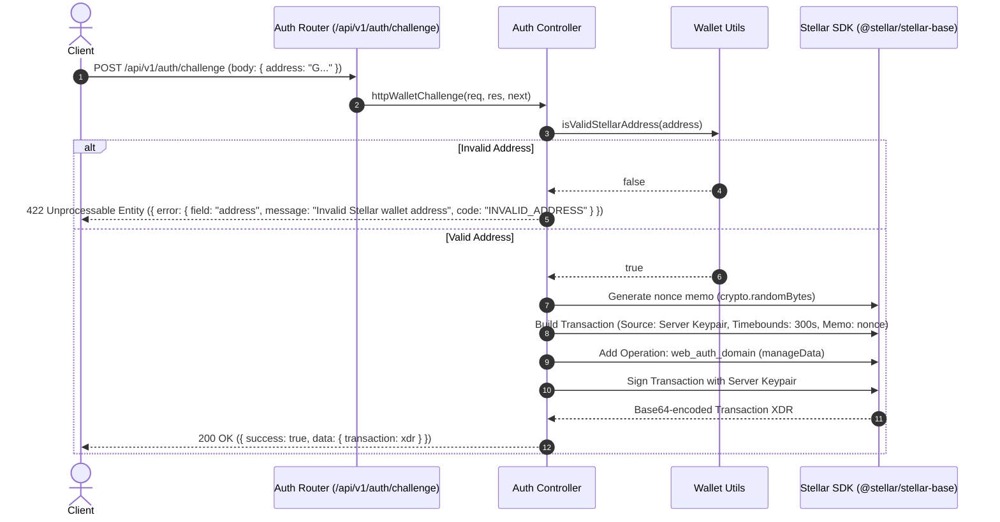

# Technical Specification — Issue #717: Wallet Auth Challenge Integration Tests & Endpoint

## System Architecture & Sequence Diagram

## Quality Gates

- Format Check: `prettier --check` ✅
- Lint Check: `eslint` (Flat Config) ✅
- Type Check: `tsc --noEmit` ✅
- Security Audit: `npm audit` / CodeQL clean ✅
- Unit & Integration Tests: Pass 100% ✅
- Coverage: ≥ 80% on changed code ✅

## Target Toolchain & Configuration

- Runtime: Node.js 22 LTS / Node 24
- Package Manager: `pnpm`
- Language: TypeScript 5.9
- Test Runner: Jest 30 (`ts-jest`)
- Linter: ESLint 9 (Flat Config `eslint.config.js` with `@typescript-eslint`)
- Formatter: Prettier 3 (`.prettierrc`)

## Acceptance Criteria

- [x] `POST /api/v1/auth/challenge` returns 200 OK with valid base64 XDR when provided a valid Stellar wallet address.
- [x] Decoded XDR transaction contains `web_auth_domain` operation (manageData).
- [x] Nonce memo is non-empty and unique across consecutive calls.
- [x] Returns 422 Unprocessable Entity when called with an invalid Stellar wallet address.
- [x] Transaction is signed by the server keypair.
